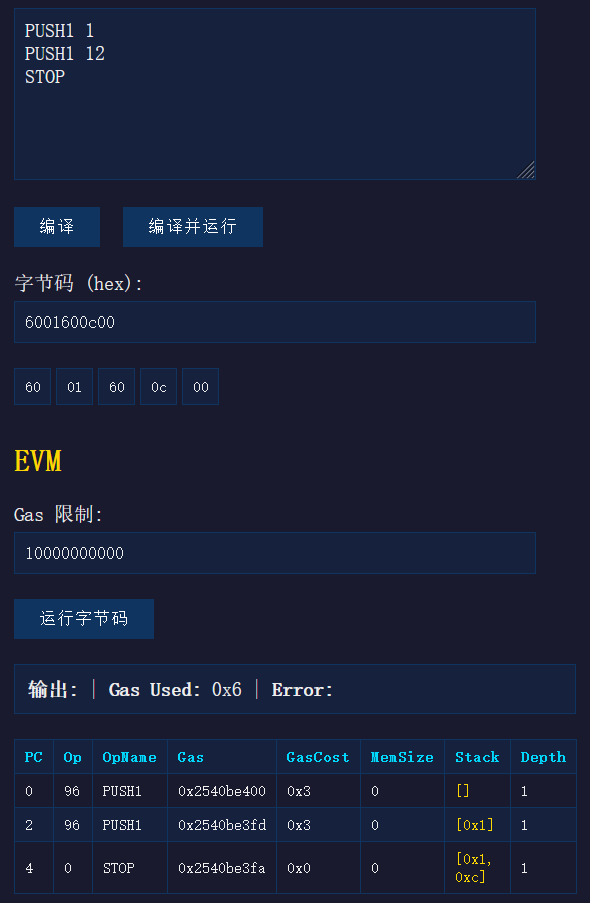

# EVM64 - 64-bit Ethereum Virtual Machine

A JavaScript implementation of a **64-bit** Ethereum Virtual Machine (EVM). This project deviates from the standard 256-bit EVM to focus on a 64-bit architecture, while maintaining the core logic and opcode structure of the EVM.



## Features

*   **64-bit Architecture**: Operates on 64-bit integers instead of 256-bit.
*   **Dual Interface**:
    *   **CLI**: Command-line tools for running bytecode and compiling assembly.
    *   **Web**: An interactive HTML interface for executing and debugging code.
*   **Trace Compatibility**: Output format mimics the official Go-Ethereum (Geth) `--trace` flag, facilitating debugging and comparison.
*   **Complete Instruction Set**: Implements a comprehensive set of 64 opcodes tailored for 64-bit operations.

## Project Structure

*   **`core/`**: Core logic of the VM and Compiler.
    *   `evm64.mjs`: The Virtual Machine implementation.
    *   `compiler.mjs`: Assembly to bytecode compiler.
    *   `memory.mjs`: Memory management module.
    *   `code.mjs`: Bytecode parsing and handling.
*   **`app/`**: Application entry points.
    *   `evm64-cli.mjs`: CLI for the VM.
    *   `compiler-cli.mjs`: CLI for the Compiler.
    *   `evm64.html`: Web interface.
*   **`common/`**: Shared utilities and opcode definitions.

## Usage

### 1. VM CLI

Run bytecode directly from the command line.

**Basic Run:**
```bash
node app/evm64-cli.mjs run <bytecode_hex>
```

**Run with Trace:**
```bash
node app/evm64-cli.mjs run --trace <bytecode_hex>
```

Example:
```bash
# Runs PUSH1 0x02, PUSH1 0x03, ADD (2 + 3 = 5)
node app/evm64-cli.mjs run --trace 6002600301
```

### 2. Compiler CLI

Compile assembly code to bytecode or disassemble bytecode.

**Compile Assembly:**
```bash
node app/compiler-cli.mjs compile <file.asm>
```

**Disassemble Bytecode:**
```bash
node app/compiler-cli.mjs disassemble <bytecode_hex>
```

### 3. Web Interface

Open `app/evm64.html` in your browser to access the graphical interface. It allows you to:
*   Input bytecode.
*   Run execution.
*   View stack, memory, and execution logs.

## Development

### Testing
*   **Assembly Tests**: `test.asm` contains assembly test cases.
*   **Loop Tests**: `test_loop.mjs` verifies loop constructs.
    ```bash
    node test_loop.mjs
    ```
*   **Opcode Tests**: `test_opcodes.py` creates specific opcode tests and compares them against the official `evm` implementation (requires `evm` command).
    ```bash
    python3 test_opcodes.py
    ```

### Conventions
*   **Binary Operations**: Follow `a = pop(); b = pop(); r = a op b`.
*   **Verification**: Always compare execution trace with `evm run --trace` (adjusted for 64-bit) when adding new features.
*   **Sync**: Updates to the VM (`core/evm64.mjs`) must be reflected in the compiler (`core/compiler.mjs`).

## Supported Instructions

See [IMPLEMENTED.md](IMPLEMENTED.md) for a full list of supported opcodes and their status.
